# Project Flow Map

This is the current high-level map of the whole project so we do not need to keep the system in our heads.

## 0. Master Connected Flow

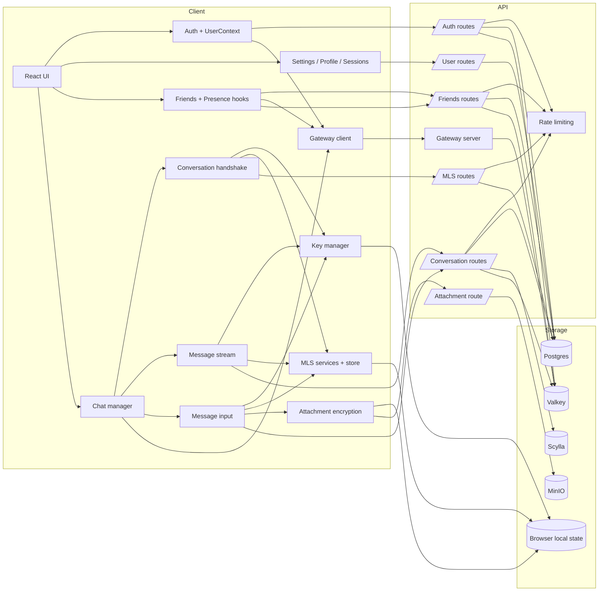

Use this section as the “how everything connects” map.
The sections below zoom into one lane at a time so the details stay readable.

## 1. System Shape

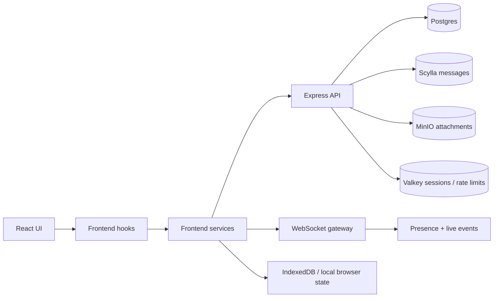

Main frontend layers:
- auth: [UserContext.tsx](/home/void0000/Desktop/VOIDAPP/VOID0000-www/src/Services/Auth/UserContext.tsx), [authServiceApi.ts](/home/void0000/Desktop/VOIDAPP/VOID0000-www/src/Services/Auth/authServiceApi.ts)
- chat: [chatService.ts](/home/void0000/Desktop/VOIDAPP/VOID0000-www/src/Services/Chat/chatService.ts), [messageService.ts](/home/void0000/Desktop/VOIDAPP/VOID0000-www/src/Services/Chat/messageService.ts)
- crypto: [keyManager.ts](/home/void0000/Desktop/VOIDAPP/VOID0000-www/src/Services/Crypto/keyManager.ts), [chatCryptoProtocolService.ts](/home/void0000/Desktop/VOIDAPP/VOID0000-www/src/Services/Crypto/protocols/chatCryptoProtocolService.ts)
- gateway: [gateway.ts](/home/void0000/Desktop/VOIDAPP/VOID0000-www/src/Services/Gateway/gateway.ts)

Main backend surfaces:
- auth routes: [/server/routes/auth](/home/void0000/Desktop/VOIDAPP/VOID0000-api/server/routes/auth)
- user routes: [/server/routes/user](/home/void0000/Desktop/VOIDAPP/VOID0000-api/server/routes/user)
- friends routes: [/server/routes/friends](/home/void0000/Desktop/VOIDAPP/VOID0000-api/server/routes/friends)
- conversation routes: [/server/routes/conversations](/home/void0000/Desktop/VOIDAPP/VOID0000-api/server/routes/conversations)
- gateway: [/server/gateway](/home/void0000/Desktop/VOIDAPP/VOID0000-api/server/gateway)

## 2. Auth Login Flow

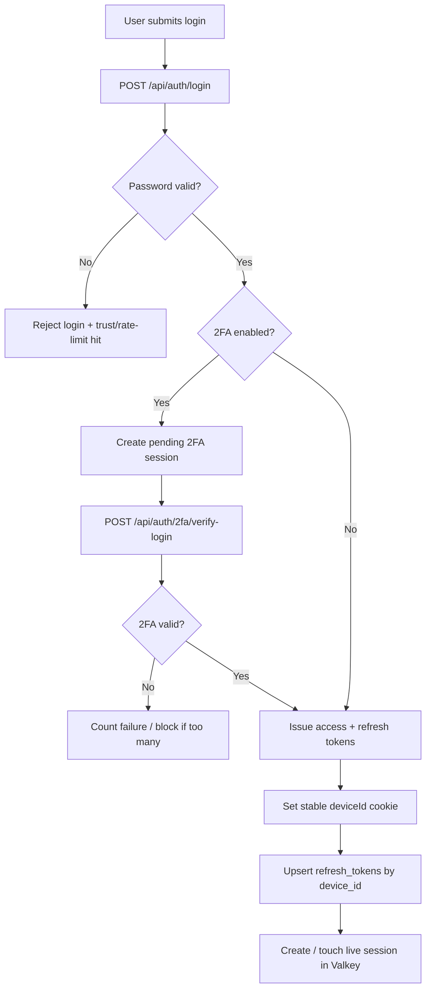

Key files:
- [login.js](/home/void0000/Desktop/VOIDAPP/VOID0000-api/server/routes/auth/login.js)
- [verify-login.js](/home/void0000/Desktop/VOIDAPP/VOID0000-api/server/routes/auth/2fa/verify-login.js)
- [refresh.js](/home/void0000/Desktop/VOIDAPP/VOID0000-api/server/routes/auth/refresh.js)
- [deviceFingerprint.js](/home/void0000/Desktop/VOIDAPP/VOID0000-api/server/utils/deviceFingerprint.js)

## 3. Session Flow

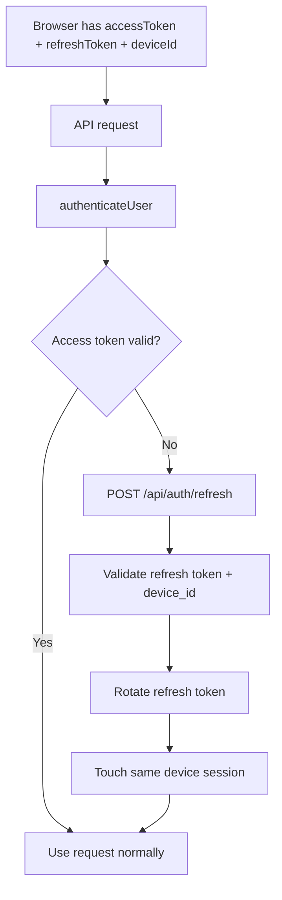

Notes:
- `deviceId` is stable and no longer tied to current IP.
- Active Sessions is device-based now, not IP-churn-based.
- Session list route: [sessions.js](/home/void0000/Desktop/VOIDAPP/VOID0000-api/server/routes/user/sessions.js)

## 4. Profile / Account / Settings Flow

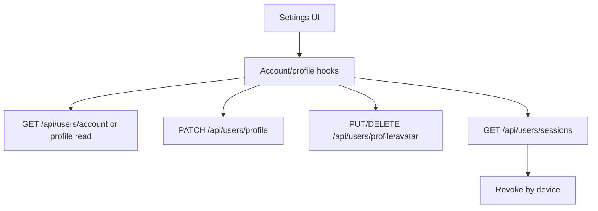

Key files:
- [useProfileRecord.ts](/home/void0000/Desktop/VOIDAPP/VOID0000-www/src/Services/hooks/profile/useProfileRecord.ts)
- [useProfileAvatarUpload.ts](/home/void0000/Desktop/VOIDAPP/VOID0000-www/src/Services/hooks/profile/useProfileAvatarUpload.ts)
- [profileFields.js](/home/void0000/Desktop/VOIDAPP/VOID0000-api/server/routes/user/profileFields.js)
- [profileAvatar.js](/home/void0000/Desktop/VOIDAPP/VOID0000-api/server/routes/user/profileAvatar.js)

## 5. Friends + Presence Flow

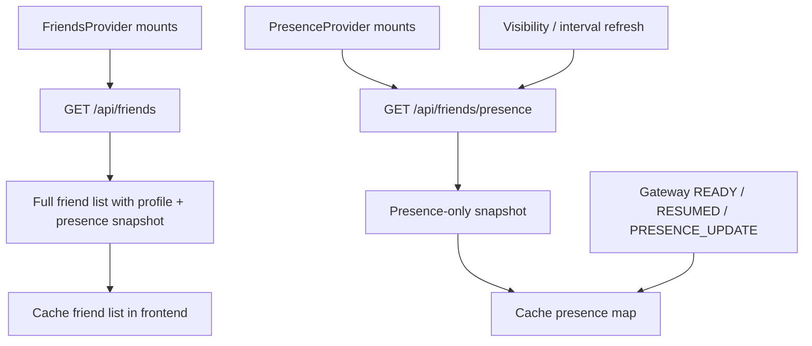

Notes:
- full list and presence are now separate routes
- presence uses its own rate-limit bucket
- friend requests live separately from the accepted-friends cache

Key files:
- [useFriends.tsx](/home/void0000/Desktop/VOIDAPP/VOID0000-www/src/Services/hooks/Friends/useFriends.tsx)
- [usePresence.tsx](/home/void0000/Desktop/VOIDAPP/VOID0000-www/src/Services/hooks/Friends/usePresence.tsx)
- [useFriendRequests.tsx](/home/void0000/Desktop/VOIDAPP/VOID0000-www/src/Services/hooks/Friends/useFriendRequests.tsx)
- [list.js](/home/void0000/Desktop/VOIDAPP/VOID0000-api/server/routes/friends/list.js)
- [presence.js](/home/void0000/Desktop/VOIDAPP/VOID0000-api/server/routes/friends/presence.js)
- [actions.js](/home/void0000/Desktop/VOIDAPP/VOID0000-api/server/routes/friends/actions.js)

## 6. Conversation Flow

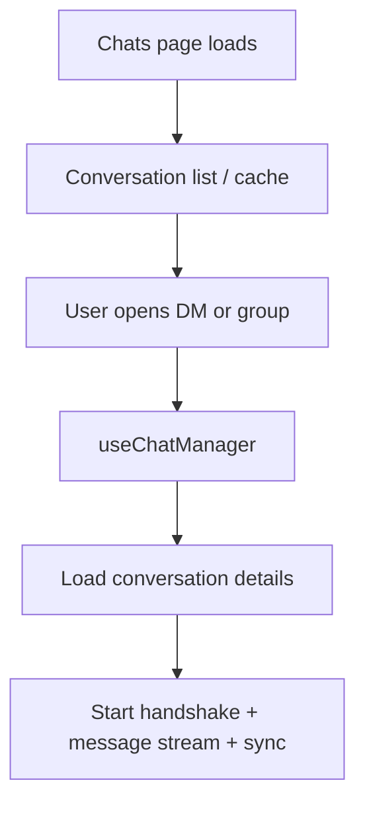

Frontend chat control:
- [useChatManager.ts](/home/void0000/Desktop/VOIDAPP/VOID0000-www/src/Services/hooks/Chats/useChatManager.ts)
- [useConversationSync.ts](/home/void0000/Desktop/VOIDAPP/VOID0000-www/src/Services/hooks/Chats/useConversationSync.ts)
- [useMessageList.ts](/home/void0000/Desktop/VOIDAPP/VOID0000-www/src/Services/hooks/Chats/useMessageList.ts)

Backend conversation entry:
- [index.js](/home/void0000/Desktop/VOIDAPP/VOID0000-api/server/routes/conversations/index.js)

## 7. DM / Group Creation Flow

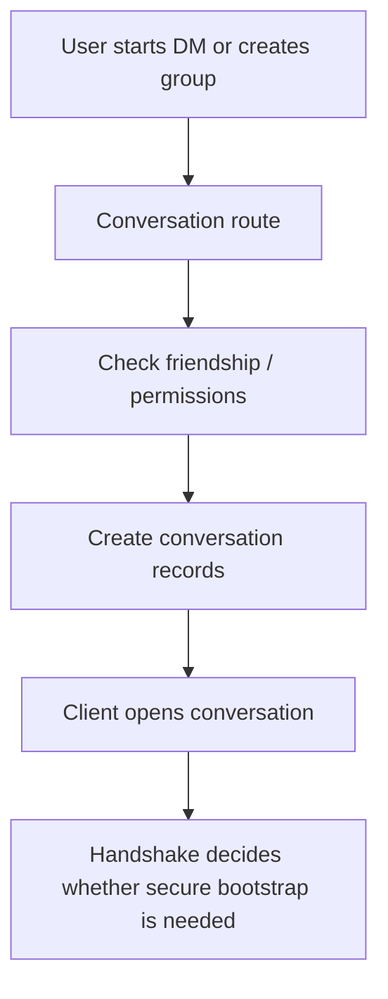

Relevant routes:
- [dm.js](/home/void0000/Desktop/VOIDAPP/VOID0000-api/server/routes/conversations/dm.js)
- [root index](/home/void0000/Desktop/VOIDAPP/VOID0000-api/server/routes/conversations/root/index.js)
- [members.js](/home/void0000/Desktop/VOIDAPP/VOID0000-api/server/routes/conversations/members.js)

## 8. Chat Open / Handshake Flow

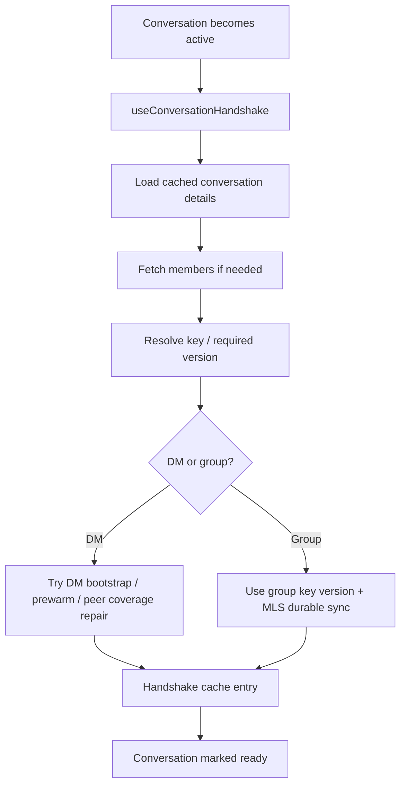

Key files:
- [useConversationHandshake.ts](/home/void0000/Desktop/VOIDAPP/VOID0000-www/src/Services/hooks/Chats/useConversationHandshake.ts)
- [chatCryptoService.ts](/home/void0000/Desktop/VOIDAPP/VOID0000-www/src/Services/Chat/chatCryptoService.ts)
- [conversationSecurityState.ts](/home/void0000/Desktop/VOIDAPP/VOID0000-www/src/Services/Chat/conversationSecurityState.ts)

## 9. MLS Flow

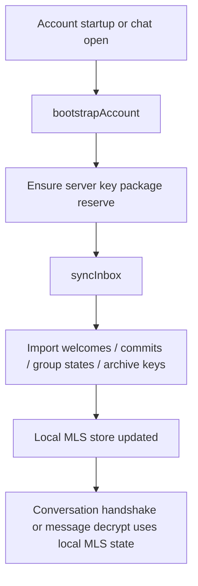

MLS backend routes:
- [mls.js](/home/void0000/Desktop/VOIDAPP/VOID0000-api/server/routes/conversations/mls.js)
- [keyPackages.js](/home/void0000/Desktop/VOIDAPP/VOID0000-api/server/routes/conversations/mls/keyPackages.js)
- [groupStates.js](/home/void0000/Desktop/VOIDAPP/VOID0000-api/server/routes/conversations/mls/groupStates.js)
- [welcomes.js](/home/void0000/Desktop/VOIDAPP/VOID0000-api/server/routes/conversations/mls/welcomes.js)
- [commits.js](/home/void0000/Desktop/VOIDAPP/VOID0000-api/server/routes/conversations/mls/commits.js)
- [groupKeyArchive.js](/home/void0000/Desktop/VOIDAPP/VOID0000-api/server/routes/conversations/mls/groupKeyArchive.js)
- [sync.js](/home/void0000/Desktop/VOIDAPP/VOID0000-api/server/routes/conversations/mls/sync.js)

MLS frontend services:
- [mlsService.ts](/home/void0000/Desktop/VOIDAPP/VOID0000-www/src/Services/Crypto/mls/mlsService.ts)
- [mlsGroupService.ts](/home/void0000/Desktop/VOIDAPP/VOID0000-www/src/Services/Crypto/mls/mlsGroupService.ts)
- [mlsStore.ts](/home/void0000/Desktop/VOIDAPP/VOID0000-www/src/Services/Crypto/mls/mlsStore.ts)
- [chatCryptoProtocolService.ts](/home/void0000/Desktop/VOIDAPP/VOID0000-www/src/Services/Crypto/protocols/chatCryptoProtocolService.ts)

Notes:
- current protocol lane is MLS-based account-scope chat
- durable catch-up comes from synced welcomes, commits, group states, and archived keys
- commit receipts are per user, which matches the account-scope model
- the current MLS implementation depends on `ts-mls`, which upstream has explicitly said is not formally audited yet

## 10. Message History + Live Stream

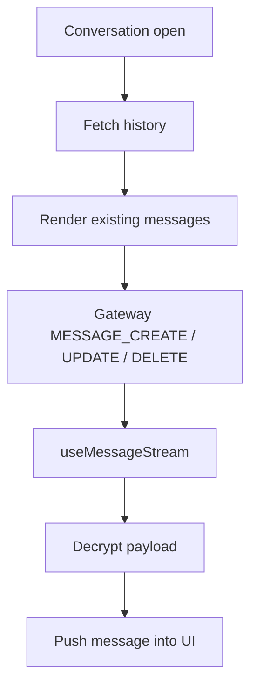

Key files:
- [messages.js](/home/void0000/Desktop/VOIDAPP/VOID0000-api/server/routes/conversations/messages.js)
- [useMessageStream.ts](/home/void0000/Desktop/VOIDAPP/VOID0000-www/src/Services/hooks/Chats/useMessageStream.ts)
- [messageEnvelope.ts](/home/void0000/Desktop/VOIDAPP/VOID0000-www/src/Services/Chat/messageEnvelope.ts)

## 11. Message Send Flow

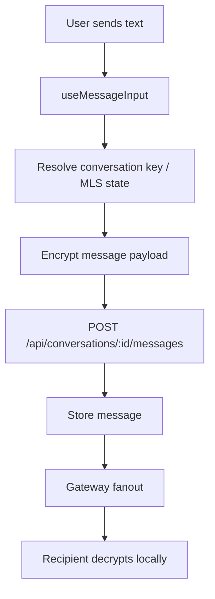

Relevant files:
- [useMessageInput.ts](/home/void0000/Desktop/VOIDAPP/VOID0000-www/src/Services/hooks/Chats/useMessageInput.ts)
- [messageService.ts](/home/void0000/Desktop/VOIDAPP/VOID0000-www/src/Services/Chat/messageService.ts)
- [create.js](/home/void0000/Desktop/VOIDAPP/VOID0000-api/server/routes/conversations/messages/create.js)

## 12. Typing / Read / Reactions Flow

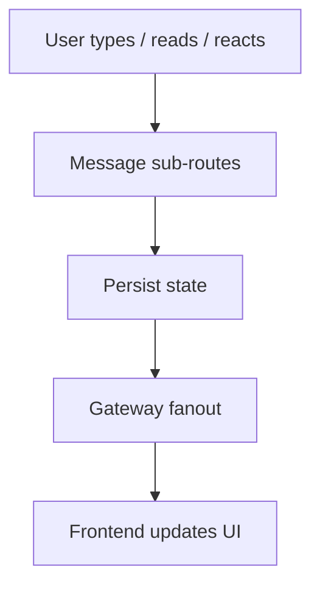

Relevant files:
- [typing.js](/home/void0000/Desktop/VOIDAPP/VOID0000-api/server/routes/conversations/messages/typing.js)
- [read.js](/home/void0000/Desktop/VOIDAPP/VOID0000-api/server/routes/conversations/messages/read.js)
- [reactions.js](/home/void0000/Desktop/VOIDAPP/VOID0000-api/server/routes/conversations/reactions.js)
- [batchReactions.js](/home/void0000/Desktop/VOIDAPP/VOID0000-api/server/routes/conversations/batchReactions.js)

## 13. Encrypted Attachment Flow

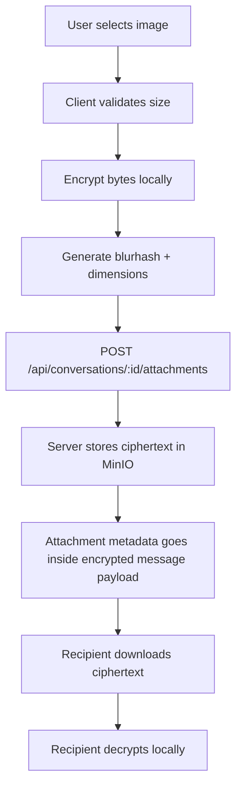

Notes:
- MinIO stores ciphertext, not readable image files
- attachment metadata is carried inside the secure message path
- plaintext attachment uploads are disabled server-side

Key files:
- [attachmentEncryption.ts](/home/void0000/Desktop/VOIDAPP/VOID0000-www/src/Services/Crypto/attachmentEncryption.ts)
- [messageAttachments.ts](/home/void0000/Desktop/VOIDAPP/VOID0000-www/src/Services/Chat/messageAttachments.ts)
- [attachments.js](/home/void0000/Desktop/VOIDAPP/VOID0000-api/server/routes/conversations/attachments.js)

## 14. Gateway Flow

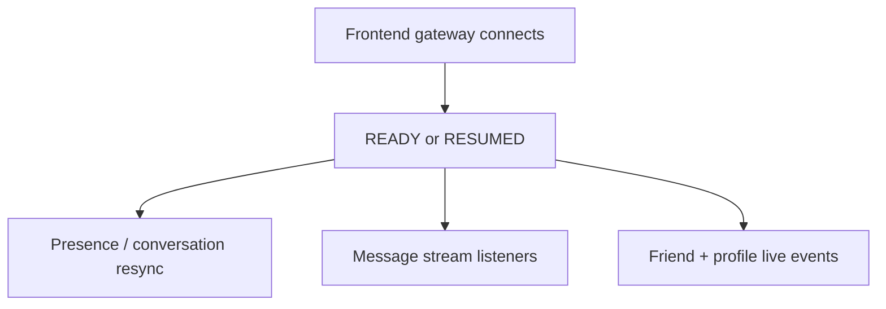

Gateway files:
- [gateway.ts](/home/void0000/Desktop/VOIDAPP/VOID0000-www/src/Services/Gateway/gateway.ts)
- [client.js](/home/void0000/Desktop/VOIDAPP/VOID0000-api/server/gateway/client.js)
- [control.js](/home/void0000/Desktop/VOIDAPP/VOID0000-api/server/gateway/control.js)
- [presence-fanout.js](/home/void0000/Desktop/VOIDAPP/VOID0000-api/server/gateway/presence-fanout.js)
- [protocol.js](/home/void0000/Desktop/VOIDAPP/VOID0000-api/server/gateway/protocol.js)

## 15. Storage Map

- Postgres:
  users, profiles, friendships, refresh tokens, MLS metadata, conversation metadata
- Scylla:
  message bodies / message timeline storage
- MinIO:
  encrypted attachment blobs
- Valkey:
  active sessions, rate limits, some short-lived auth state
- Browser local state:
  account key material, MLS local state, caches, decrypted-in-memory media cache

## 16. Rate Limiting Map

Main limiter buckets live in [rate_limit.js](/home/void0000/Desktop/VOIDAPP/VOID0000-api/server/middleware/rate_limit.js).

Important current buckets:
- auth login
- forgot/reset/register
- auth refresh/check
- friends list
- friends presence
- friend actions
- messages fetch/send
- MLS sync / key-package / archive
- DM anti-spam guard

## 17. Recovery / Backup Flow

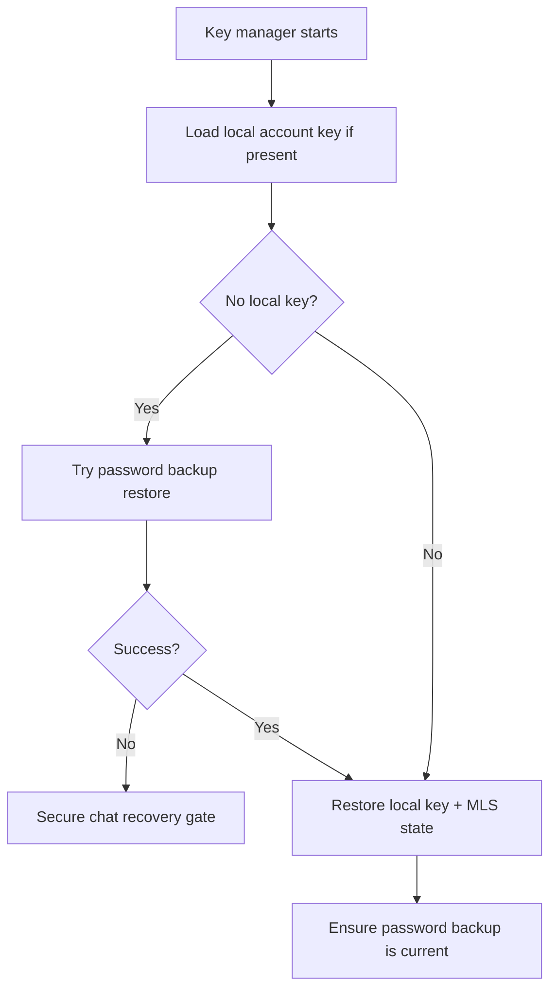

Notes:
- password backup is the active recovery path
- forgot-password on a fresh device can still require the old password
- full limitation doc: [secure-chat-recovery-limitations.md](./secure-chat-recovery-limitations.md)

## 18. Current Known Limits

- secure chat recovery after forgot-password is still limited on fresh devices
- the current `ts-mls` dependency has no formal upstream security audit yet
- some flows are durable, but edge-case testing still matters after auth/session/MLS changes
- this doc is meant to be updated when auth, sessions, friends, conversations, MLS, or recovery behavior changes
